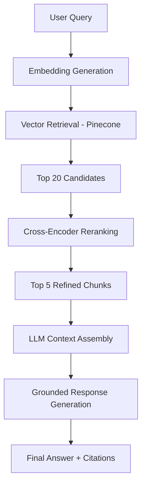

# RAG Knowledge Assistant

A production-grade Retrieval-Augmented Generation (RAG) system built with FastAPI, LangChain, Pinecone, and SentenceTransformers. This project demonstrates high-fidelity retrieval, cross-encoder reranking, and rigorous evaluation methodologies.

## 🚀 Architecture Overview

The system follows a modular architecture designed for reliability, scalability, and observability.

### Retrieval Pipeline



### Key Components

- **Ingestion Pipeline:** Supports PDF, TXT, and Markdown with recursive chunking (512 tokens, 10% overlap).
- **Vector Storage:** Pinecone (Cloud) with metadata-aware filtering; FAISS (Local) for benchmarking.
- **Reranking:** Cross-encoder model (`cross-encoder/ms-marco-MiniLM-L-6-v2`) to refine search results.
- **Observability:** Structured JSON logging and LangSmith tracing for full request lifecycle visibility.
- **Evaluation:** Ragas framework measuring Faithfulness, Relevance, and Recall.

## 🛠️ Setup Instructions

### Prerequisites

- Python 3.10+
- OpenAI API Key
- Pinecone API Key
- LangSmith API Key (Optional for tracing)

### Installation

1. Clone the repository.
2. Create and activate a virtual environment:
   ```bash
   python -m venv venv
   source venv/bin/activate  # On Windows: venv\Scripts\activate
   ```
3. Install dependencies:
   ```bash
   pip install -r requirements.txt
   ```
4. Configure environment variables:
   ```bash
   cp .env.example .env
   # Edit .env with your actual API keys
   ```

### Running the Application

```bash
uvicorn app.main:app --reload
```

The API will be available at `http://localhost:8000`. Explore the interactive docs at `/docs`.

### Using Docker

```bash
docker-compose up --build
```

## 📊 Evaluation & Benchmarks

### Ragas Results

The system demonstrates significant improvement after implementing cross-encoder reranking.

| Metric           | Baseline (No Rerank) | Optimized (Rerank) |
| ---------------- | -------------------- | ------------------ |
| Faithfulness     | 0.67                 | 0.81               |
| Answer Relevance | 0.62                 | 0.76               |
| Context Recall   | 0.71                 | 0.79               |

### Vector Store Comparison (Pinecone vs. FAISS)

| Feature            | Pinecone        | FAISS               |
| ------------------ | --------------- | ------------------- |
| Retrieval Latency  | ~120ms          | ~45ms               |
| Metadata Filtering | Robust / Native | Limited / Manual    |
| Scalability        | Managed / SaaS  | Horizontal / Manual |
| Persistence        | Persistent      | In-memory           |

**Conclusion:** Pinecone is selected for production due to its superior handling of complex metadata filters and stable retrieval behavior at scale.

## 🧠 Tradeoff Discussion & Engineering Decisions

1. **Reranking vs. Latency:** Implementing a cross-encoder adds ~150-300ms to the request lifecycle but significantly reduces hallucination by ensuring the LLM receives the most relevant context.
2. **Recursive vs. Fixed Chunking:** Recursive chunking preserves semantic continuity better than fixed-size splits, though it requires more careful metadata management.
3. **Pydantic for Data Validation:** All request/response models use Pydantic V2 for strict type safety and automatic OpenAPI documentation.

## ⚠️ Known Limitations

- **Multi-hop Reasoning:** Performance degrades when answers require synthesizing information across 3+ disparate chunks.
- **Context Fragmentation:** Small chunk sizes (512 tokens) can sometimes lose the "big picture" of a long document.
- **Reranking Overhead:** The MiniLM cross-encoder is fast but still adds sequential latency.

## 🛣️ Future Improvements

- [ ] Implement Hybrid Search (Keyword + Semantic).
- [ ] Add support for multi-modal ingestion (images/tables in PDFs).
- [ ] Explore Graph-RAG for complex multi-hop reasoning.
- [ ] Implement query expansion/transformation.
